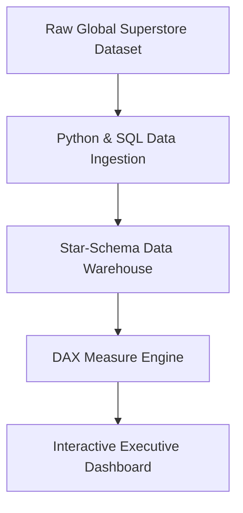

<div align="center">

# 📊 Global Superstore Analytics

### *Enterprise PowerBI & Data Engineering Analytics Ecosystem*

[](#)
[](https://powerbi.microsoft.com)
[](#)
[](LICENSE)

<p align="center">
  <a href="#-data-architecture">Architecture</a> •
  <a href="#-key-features">Features</a> •
  <a href="#-workflow">Workflow</a> •
  <a href="#-dashboard-previews">Previews</a> •
  <a href="#-faq">FAQ</a>
</p>

</div>

---

## 📖 Overview

**Global Superstore Analytics** is an end-to-end data analytics and business intelligence ecosystem evaluating multi-region retail supply chain dynamics, profitability drivers, DAX measure modeling, and shipping latency optimization.

---

## 🌟 Key Features

<table>
  <tr>
    <td width="50%" valign="top">
      <h4>📈 Star-Schema Data Model</h4>
      <p>Relational SQL data structure connecting Fact Table (Orders) with Dimension Tables (Customers, Products, Location).</p>
    </td>
    <td width="50%" valign="top">
      <h4>💡 DAX Profit Margin Metrics</h4>
      <p>Custom DAX measures tracking Year-Over-Year (YoY) revenue growth, discount impacts, and profit loss thresholds.</p>
    </td>
  </tr>
  <tr>
    <td width="50%" valign="top">
      <h4>🗺️ Geographic Profit Mapping</h4>
      <p>Interactive spatial mapping identifying regional shipping cost leaks across North America, Europe, and LATAM.</p>
    </td>
    <td width="50%" valign="top">
      <h4>📦 Interactive PowerBI Lineage</h4>
      <p>Cross-filtering across customer segments (Consumer, Corporate, Home Office) and shipping modes.</p>
    </td>
  </tr>
</table>

---

## 📐 Data Architecture



---

## 🔄 Analytics Workflow

```text
[Raw Retail Orders] ➔ [ETL Data Cleaning] ➔ [Star-Schema Modeling] ➔ [DAX Calculations] ➔ [PowerBI Dashboard]
```

---

## ❓ FAQ (Frequently Asked Questions)

<details>
<summary><b>1. Where can I view the live interactive PowerBI Dashboard?</b></summary>
<br/>
You can access the live service dashboard on <a href="https://app.powerbi.com/groups/me/lineage">PowerBI Service Lineage Workspace</a>.
</details>

<details>
<summary><b>2. What dataset is utilized?</b></summary>
<br/>
The Kaggle Global Superstore dataset containing over 50,000 international retail order transactions.
</details>

---

## 👥 Contributors

<a href="https://github.com/sanmitpatil07/global-superstore-analytics/graphs/contributors">
  
</a>

---

## 📄 License

Distributed under the **MIT License**. See [`LICENSE`](LICENSE) for details.
